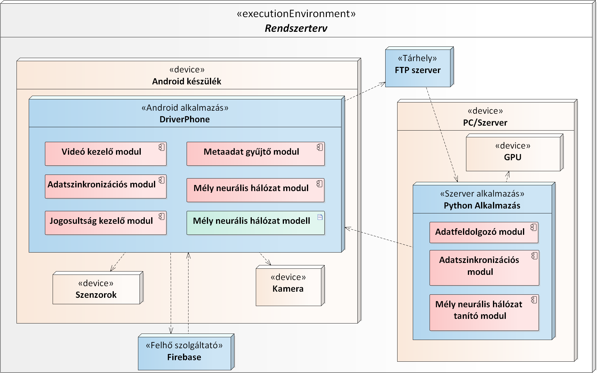
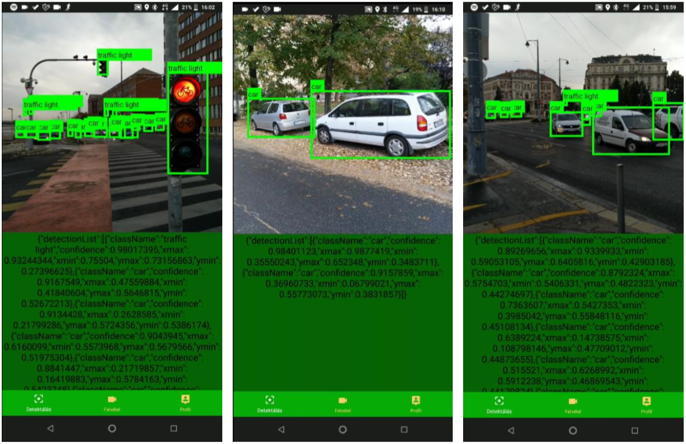
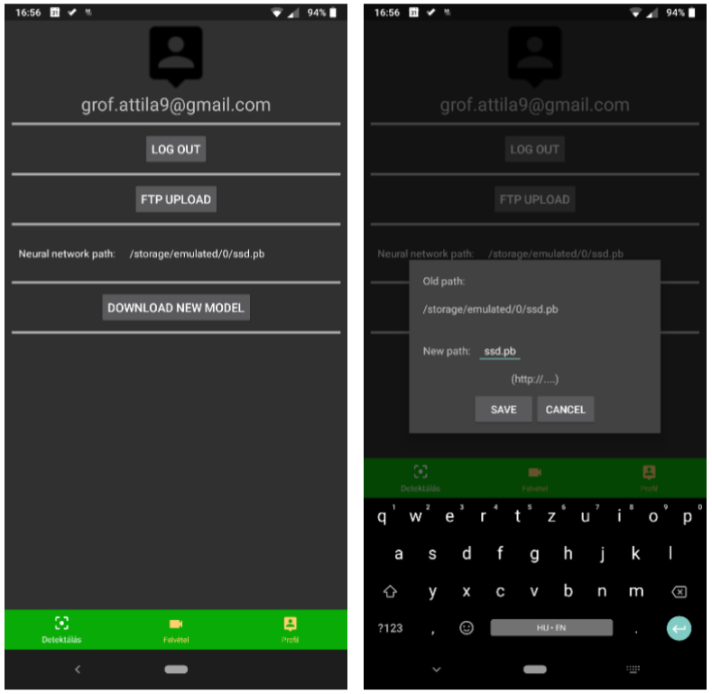

# Vezetést segítő funkciók fejlesztése okostelefonra mély tanulás alapon

## TDK dolgozat elérhetősége: [Dolgozat](http://tdk.bme.hu/VIK/Neural/Vezetest-segito-funkciok-fejlesztese)
 Budapesti Műszaki és Gazdaságtudományi Egyetem Tudományos Diákköri Konferencián Neurális Hálózatok szekcióban II. helyezet.

## Rövidebb összefoglaló Medium cikk elérhetősége: [Cikk](https://medium.com/@SmartLabAI/vezet%C3%A9st-seg%C3%ADt%C5%91-funkci%C3%B3k-fejleszt%C3%A9se-okostelefonra-m%C3%A9ly-tanul%C3%A1s-alapon-c4f42f0423ca)

## Tartalom

- Általános leírás
- Architektúra ábra
- Modul leírások
- Használt szoftverek, csomagok
- Futtatás lokálisan 
- Összefoglalás, eredmények

## Általános leírás
A repository tartalmaz egy Android alkalmazást, amely autókat, buszok és jelző lámpákat detektál a kamera képén úgy, hogy a háttérben mély neurális hálózatok számításait a készülék processzorán futtatja. Az alkalmazás emellett képes videó rögzítésére, amelyet egy FTP tárhelyre fel tud tölteni. A szerver oldal a feltöltött videók feldolgozásával a mély neurális hálózat tovább tanítására képes, majd az „okosabb” hálózatot vissza tudja szinkronizálni az Androidos készülékre. A felhasználók számának növekedésével a begyűjtött tanító adat mennyisége is lineárisan nő, ezzel biztosítva a lehetőséget, hogy olyan adatokkal is tanítsunk, ami egyébként nem állna rendelkezésünkre. Az alkalmazás felhasználók kezelésre is képes, így a felhasználók hozzáférést az alkalmazás funkcióihoz távolról lehet korlátozni.

## Architektúra ábra


## Modul leírások

### DriverPhone 
Több modulból álló Android alkalmazás, amely vezetést segítő funkciókat szolgáltat felhasználóinak. Ezek a funkciók autók, buszok és jelző lámpák detektálást jelentik, amelyeket a felhasználóknak a kijelzőn kell mutatni. Emellett videó rögzítésére, felhasználó beállításokra, adat szinkronizálásokra és mély neurális hálózat konfigurációjára is lehetőséget ad. 

#### Videó kezelő modul 
A videó kezelő modulnak elsődleges feladata, hogy a kamera képét élőben mutassa a felhasználónak megfelelően a képernyő méretéhez képest és képes legyen rögzíteni.

#### Metaadat gyűjtő modul 
Az alkalmazás futása közben rögzít külön féle metaadatokat, amelyek később hasznosak lehetnek.

#### Mély neurális hálózat modul 
Az Android alkalmazással képes olyan mély neurális hálózatot futtatni, amellyel a kamera képét lehet elemezni. Ezek első sorban konvolúciós hálózatokat jelentenek. A hálózatok számításait a készüléken végezzük, hogy az internet kapcsolat nélkül is funkcionális legyen.

#### Adatszinkronizációs modul 
Ennek a modulnak egyik fő feladata a videó kezelő modul és a metaadat gyűjtő modul által létrehozott fájlok egy távoli tárhelyre való feltöltése.

#### Jogosultság kezelő modul 
A jogosultság kezelő modul a nevéből is kikövetkeztethető módon a felhasználó kezeléssel foglalkozik. 
### Python alkalmazás 
A Python alkalmazás egy távoli szerveren fut, Linux operációs rendszer alatt. Az alkalmazás feladata, hogy a felhasználói funkciókat megvalósító mély neurális hálózat tovább tanítása lehetséges legyen. Ehhez szükség van tanító adatok előállítására feltöltött videókból, tanításra és egy webszerverre, ahonnan az alkalmazás az új modellt képes letölteni.  

#### Adatfeldolgozó modul 
Az adatfeldolgozó modulnak a feladata a tanító adatok előállítása. A Python alkalmazás nyers videó fájlokat kap, amelyeket át kell alakítani képkockákra. Ezeken a képkockákon meg kell állapítani, hogy hol milyen objektum osztályok találhatóak, majd a tanításhoz szükséges adatokat létrehozni a megfelelő formátumban. 

#### Mély neurális hálózatot tanító modul 
A modul alkalmas SSD MobileNet hálózat tanítására, mégpedig úgy, hogy a tanítással kapcsolatos konfigurációs beállítások szabadon szerkeszthetőek. Ez magába foglalja azt is, hogy lehetőség van egy már korábban tanított hálózatot új tanító adatokkal tovább tanítani (transfer learning). Majd az „okosabb” hálózat .pb vagy .tflite típusba exportálni. 

#### Adatszinkronizációs modul 
A Python képes fájlokat letölteni egy FTP tárhelyről és ezeket háttértárra elmenteni. Ezen kívül a szerver oldali alkalmazás egy webszervert biztosít, ahonnan az Android alkalmazás képes lesz majd letölteni a mély neurális hálózat újabb verzióját

## Használt szoftverek, csomagok
#### Android alkalmazás
- Android Studio
- Java
- TendorFlow Android
- TensorFlow Lite
- Firebase Core
- Firebase UI Auth
- Apache Commons Net
- Apache Commons IO
- Http Client 
- Goolge Gson

#### Szerver oldal
- Flask
- numpy
- os
- six.moves.urllib
- sys
- tarfile
- tensorflow
- zipfile
- collections
- io
- matplotlib
- PIL
- xml
- cv2
- PIL
- timeit
- pandas
- vidstab
- moviepy

## Futtatás lokálisan 
Klónozás után az Android projektet az Android stúdióval kell megnyitni és minden konfiguráció nélkül sikeres build után telepíthető. 

A szerver oldali alkalmazás feldolgozó script az alábbi paranccsal indítható:
```
python process_data.py -s /home/atig/test_input/ -d /home/atig/test_output -v 1
```
A szerver pedig az alábbi módon indítható:
```
python server.py
```

## Összefoglalás, eredmények

Az Android alkalmazás képes TensorFlow és Keras-ban írt konvolúciós mély neurális hálózatot futtatni a készüléken lokálisan. A tovább tanított SSD MobilNet hálózat futtatásásra is képes. A Nokia 7 Plus készüléken egy predikció átlagos kiszámítási ideje ~470 ms 1000 futás alapján, míg az LG Nexus 5 esetében ez 3 másodperc fölött van.



